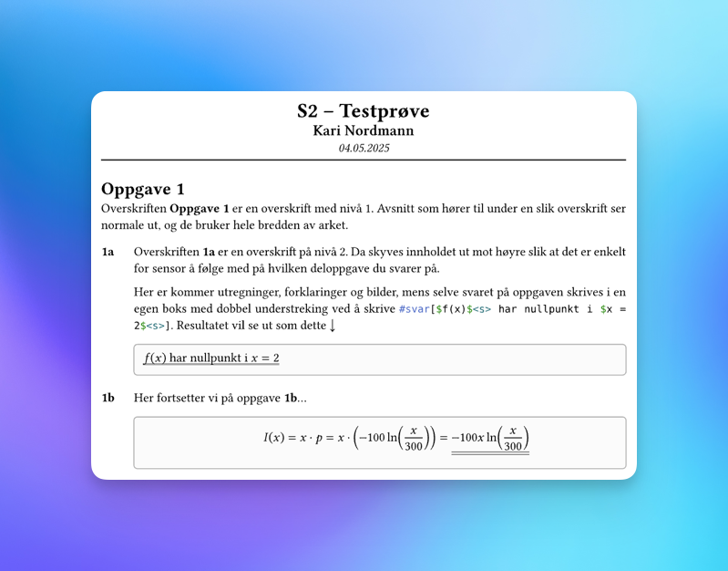

# Prøvesvar
Dette er en mal for dokumentspråket [Typst](https://typst.app/docs/tutorial/) som er beregnet for elever og studenter. Denne malen skal hjelpe deg med å skrive svar på matteprøver og innleveringer. Hvis du bruker malen vil du få en god struktur på dokumentet, og resultatet kommer til være mye penere enn dokumenter skrevet i Microsoft Word.

Denne malen bruker to viktige funksjoner for å lage oversiktlige svardokumenter:
1. Når du skriver svar på en deloppgave, for eksempel oppgave _1a_, så legges det til en ekstra marg på venstre side av dokumentet. _1a_ blir stående i denne nye margen, mens dine beregninger og forklaringer vil vises på den høyre siden av arket. Se hvordan det ser ut i skjermbildet.
2. Du kan bruke funksjonen `#svar[]` for lage en svarboks slik som vist i skjermbildet. På den måten er det enkelt for leseren å oppfatte hva som er #underline(underline[_svaret_], offset: 0.4 * doubleLinePadding) ditt på oppgaven. I svarboksen vil tekst automatisk få dobbel understreking, og du kan legge til dobbel understreking på formler.



## Oppsett av malen

- Åpne programmet [_Visual Studio Code_](https://code.visualstudio.com).
- Sørg for at utvidelsen [Tynimist Typst](https://marketplace.visualstudio.com/items?itemName=myriad-dreamin.tinymist) er installert i Visual Studio Code.
- Åpne kommandovinduet ved å trykke `ctrl` `⇧ Shift` `P` eller ved å velge _Vis_ → _Kommandopalett_ i verktøylinja.
- Skriv inn `typst initial` og velg _Typst: initialize a new Typst project based on a template_ ved å trykke på enter-knappen `⏎` .
- Skriv inn `@preview/provesvar:0.1.0` og trykk `⏎` .
- Du kan nå skrive i dokumentet, men husk å trykke på forhåndsvisningsknappen som du finner over tekstfeltet i Visual Studio Code, for å få en forhåndsvisning av det ferdige dokumentet.


Øverst i dokumentet ditt vil du se noen linjer med kode som justerer innstillingene for dokumentet ditt:

```typst
#let fag = "S2"                  // navnet på faget (eller klassen din)
#let elevNavn = "Kari Nordmann"  // ditt navn eller kandidatnummer
#let dokumentTittel = "Testprøve"// navnet på prøven
#let deloppgaveNivaaer = (2, 3)  // se forklaring nedenfor 
#let dobbelUnderstrek = true     // gir automatisk dobbel understrek i svarboks
#let spraak = "nb"               // setter språket. "nb"=bokmål", "nn"=nynorsk
#let dato = datetime.today()     // prøvedato settes automatisk til dagens dato
#let marg = 1cm                  // justerer størrelsen på ekstramargen
```

Denne malen vil automatisk gi ekstra marg på venstre side hver gang du skriver svaret på en deloppgave. I standardinnstillingene vil overskrifter med overskriftsnivå 2 og 3 bety at du svarer på en deloppgave og ønsker ekstra marg. Størrelsen på den ekstra margen er 1 cm, men dette kan du justere ved å endre på `#let marg = 1cm`. I skjermbildet er _Oppgave 1_ en overskrift med nivå 1, mens _1a_ er overskrift på nivå 2.

## Skrive med Typst
Typst er et program som leser teksten du skriver inn i `filnavn.typ`-dokumentet og lager et pent formatert PDF-dokument som du kan levere inn. I tillegg vises det hele tiden en forhåndsvisning av dokumentet ditt i Visual Studio Code.

### Overskrifter
Du må bruke overskrifter for at dokumentet skal få struktur. I Typst skrives overskrifter ved å starte med ett eller flere `=`-tegn på samme linje og deretter skrive tittelen på overskriften. Kodesnutten under viser hvordan du oppretter overskrifter på nivå 1 og 2.
```typst
= Oppgave 1
== 1a
Her kommer beregninger, forklaringer, bilder og svaret på en deloppgave.
#svar[$f(x)$<s> har nullpunkt i $x=2$<s>]
```

### Bruke overskrifter til å svare på deloppgaver
Bruk en overskrift på nivå 2 eller 3 til å svare på deloppgaver. Som standard vil begge disse overskriftene vises på venstre side av arket, mens all tekst, beregninger og bilder vises til høyre for overskriften.

Du velger selv hvilke overskriftsnivåer du bruker for deloppgaver ved å endre på `#let deloppgaveNivaaer = (2, 3)` i innstillingene. 
Hvis du skriver `#let deloppgaveNivaaer = (3, 4, 5)` så vil overskriftsnivå 3, 4 og 5 gi ekstra marg.[^1] 


### Bruke for å få dobbel understreking
Når vi svarer på oppgaver bruker vi dobbel understreking under det endelige svaret. For å gjøre svarene ekstra tydelige så bruker denne malen også en grå rute som du kan se i eksempelet over. For å skrive et svar skriver du `#svar[Her kommer svaret]`.

Matematikk og vanlig tekst behandles på to ulike måter i Typst. Hvis du skal skrive matematiske symboler i svaret ditt så er du derfor nødt til å først det matematiske uttrykket, for eksempel `$f(x)$` slik som i eksempelet, og deretter legger du til `<s>` rett etter det siste dollartegnet.

Hvis du ønsker at noe av teksten inne i svarboksen skal være uten understreking, mens andre deler skal ha understreking så kan du gjøre understrekingen manuelt. Du må da første deaktivere den automatiske understrekingen. Du kan gjøre dette for hele dokumentet ved å sette `#let dobbelUnderstreking = false` i toppen av dokumentet. Hvis du ønsker å skru av dobbel understreking for en spesifikk svarboks så skriver du `#svar(noUnderline: true)[Her kommer svaret]`. 

### Skrive matematikk
Typst er et utrolig godt verktøy for å skrive matematikk. Alt som står mellom to dollartegn (`$`) tolkes som matematiske symboler. Typst kan vise matematikk på to ulike måter. Hvis du skal gjøre lengre beregninger eller ønsker at uttrykket ditt skal være godt synlig for leseren så legger du til mellomrom mellom dollartegnene og uttrykket ditt, for eksempel vil `$ integral_1^e (ln x)/x dif x $` vises som
$ integral_1^e (ln x) / x dif x $

Den andre måten Typst kan vise matematikk på er som en del av den løpende teksten ved å ikke ha mellomrom mellom dollartegnene og uttrykket. Dette vil gjøre størrelsen på matematikkuttrykkene mindre. For eksempel vil `$u=ln x$` vises som $u=ln x$.

Her kommer en oppsummering av de viktigste tipsene for å skrive matematikk.

- Funksjoner skrives som ord: `dot`, `sin`, `ln`, `integral, dif`
- For å skrive to variabler etter hverandre så må bruke mellomrom: `$x y$` gir $x y$. Hvis man skriver `$xy$` tolker Typst $x y$ som en funksjon og gir feilmelding.
- For å skrive måleenheter eller annen tekst bruker man anførselstegn (`""`). Da vil du se at teksten bli "stående" rett opp: `$s = 0.5 "h" dot 20 "km/h" = 10 "km"$` gir $s = 0{,}5 \text{ h} \cdot 20 \text{ km/h} = 10 \text{ km}$
- Desimaltall skrives med punktum, men vises med desimalkomma: `$3.14$` gir $3.14$. _*Ikke* skriv desimaltall med komma_, da vil du få et stygt ekstra mellomrom: `$3,14$` gir $3,14$
- Når du vil dele opp matematikk over flere linjer så bruker du `\` for å lage linjeskift og `&`-tegnet for å fortelle Typst hvilket tegn du ønsker at linjene skal justeres etter. Se det første eksempelet i tabellen.


| Typst‐kode                                                                                          | Uttrykk                                                                                                              |
|-----------------------------------------------------------------------------------------------------|----------------------------------------------------------------------------------------------------------------------|
| `$A &= g \cdot h \\ &= 3 \cdot 2 = 6$`                                                            | $A = g \cdot h = 3 \cdot 2 = 6$                                                                                     |
| `$f(x) = cases(x^2 &\"når\" 0<x<1, 1/2 x + 1/2 &\"når\" x>=1)$`                                    |$\displaystyle f(x)=\begin{cases}x^2 &\text{når }0<x<1,\\[0.5em]\frac{1}{2}x+\frac{1}{2} &\text{når }x\ge1\end{cases}$ |
| `$f(x) = x^2 + e^x \"for alle\" x>0$`                                                             | $f(x) = x^2 + e^x \;\text{for alle }x>0$                                                                            |
| `$lim_(n->oo) sum_(i=1)^n f(x_i) dot Delta x$`                                                     |$\lim_{n\to\infty}\sum_{i=1}^n f(x_i)\,\Delta x$                                                                    |
| `$integral_1^e 2 u / cancel(x) dot cancel(x) dif u = [u^2]_1^e = underline(underline(e^2 - 1))$`  | $\int_{1}^{e}\frac{2u}{x}\cdot x\,du = \bigl[u^2\bigr]_{1}^{e} = \underline{\underline{e^2 - 1}}$                   |
| `$x<0 => sqrt(x) in.not RR$`                                                                      | $x<0 \Longrightarrow \sqrt{x}\notin\mathbb{R}$                                                                       |

### Bilder
Den enkleste måten å legge til bilder i Typst på er å først kopiere bildet til utklippstavlen. Det kan du gjøre ved å høyreklikke på et bilde og velge _Kopier_, og det skjer også automatisk dersom du tar skjermbilde i Windows med `PrtScr` eller `⊞` `⇧ Shift` `S`. For å sette inn bildet i dokumentet så limer du det inn ved å trykke `ctrl` `V` i Visual Studio Code. Da skal det automatisk dukke opp kode som ligner på `#image("filnavn.png")`.

Som standard vil bildet ta opp hele bredden av dokumentet, men du kan stille på dette ved endre på funksjonen som la inn bildet til `#image("filnavn.png", width: 60%)`. 

For å gjøre dokumentet enda mer profesjonelt kan du velge å sette bildet inn i en _figur_. Hver figur har sin egen figurtekst, og du kan referere til figuren i besvarelsen din. For å lage en figur bruker kan du bruke `#figure()`-funksjonen, slik som vist i kodesnutten.

```typst
#figure(image("filnavn.png", width: 60%), caption: [Figurtekst])<merkelapp>
```

Legg gjerne merke til at jeg har lagt til `<merkelapp>` rett etter `#figure()`-funksjonen. Det gjør at jeg kan referere til akkurat denne figuren ved å skrive `@merkelapp` i teksten.

### Kode
For å legge inn kode skriver du tre [graviser](https://no.wikipedia.org/wiki/Gravis) (\`\`\`) etter hverandre og deretter skrive navnet på programmeringsspråket du bruker. Avslutt kodesnutten med tre nye graviser. Se kodesnutten under.

```python
a = 3
sum = 0
for i in range(10):
    sum += a
print(f\"Summen av de 10 første leddene er {sum}.\")
```

## Quirks
Typst er et relativt nytt dokumentspråk, og jeg kjenner det ikke veldig godt selv. Denne malen er derfor langt fra perfekt, og det er derfor sannsynlig at du kommer borti noen særegenheter (engelsk: _quirks_) mens du skriver svar her.

### Formatere tall
I dette dokumentet er det en funksjon som gjør om alle desimaltall skrevet i mattemodus med desimalpunktum til tall med desimalkomma. Hvis du skriver `$6.31$` får du altså $6{,}31$. Hvis du skriver `$6,31$` så vil du få $6,31$ (med et stygt mellomrom som vi ønsker å unngå).

### Skrive flere avsnitt i en svarboks
Hvis man skriver flere avsnitt i en svarboks med `#svar[Her kommer mye tekst…]` så kan det hende at teksten i tekstboksen skyves mer mot høyre enn hva som er meningen. Du kan manuelt fikse dette ved å skrive `#svar(flereAvsnitt: true)[Her kommer mye tekst…]`.

Hvis du skal kombinere både flere avsnitt og deaktivering av dobbel understreking så skriver du `#svar(flereAvsnitt: true, noUnderline: true)[Her kommer svaret]`.

# Takk og kontaktinformasjon
Tusen takk for at du har testet ut denne malen! Tilbakemeldinger, ris og ros kan meldes til Ståle Gjelsten på e-postadressen [stalegjelsten@gmail.com](stalegjelsten@gmail.com), eller via [GitHub-repoet](https://github.com/stalegjelsten/typst-provemal).

I tillegg skal [Willow Carretero Chavez](https://github.com/carreter) ha en stor takk for å ha utviklet den [opprinnelige malen](https://github.com/carreter/problemst).

Alle dokumentene i [GitHub-repoet](https://github.com/stalegjelsten/typst-provemal) lisenseres med en MIT lisens.

[^1]: OBS! `deloppgaveNivaaer` *må* inneholde en liste med minst ett nivå (og et komma!), for eksempel skriver du `#let deloppgaveNivaaer = (6,)` for at kun overskrifter på nivå 6 skal gi ekstra marg.
